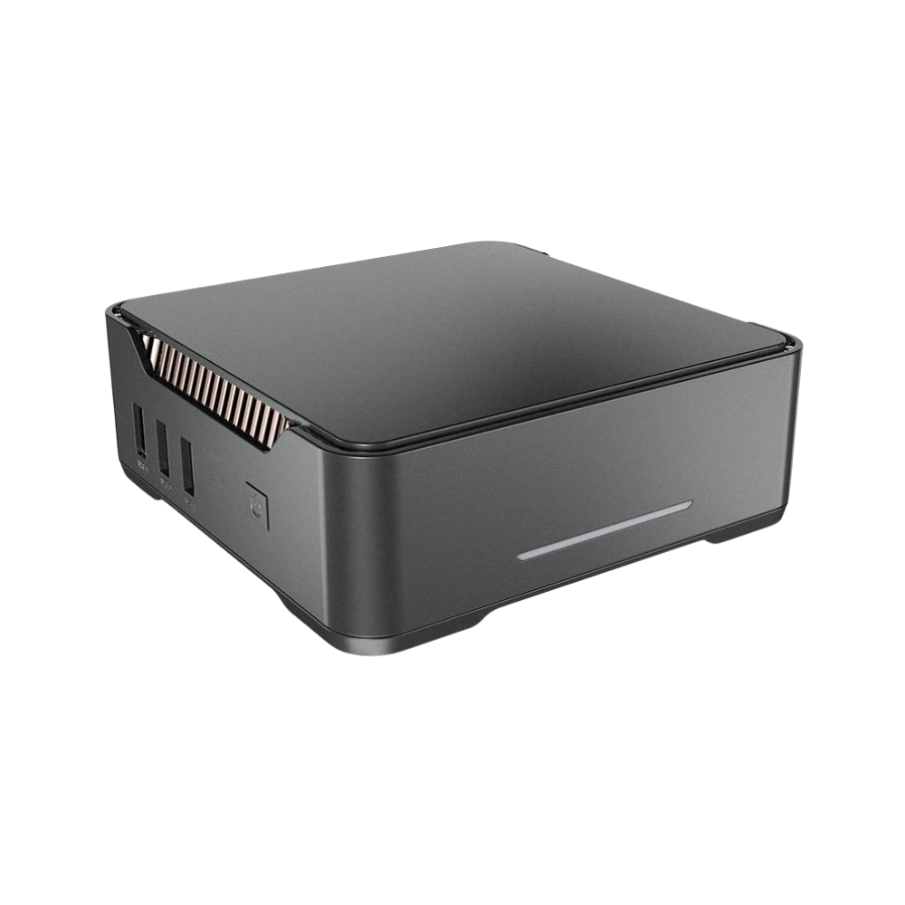

<div align="center">


# Smartify

### Make your home intelligent.

Smart switches, sensors, gateways, and control panels — built for Indian homes, engineered for every ecosystem.

**Works with Apple HomeKit · Google Home · Amazon Alexa · Matter · Home Assistant**

[Browse Products ↓](#products) · [smartify.in](https://smartify.in)

---

</div>

## Why Smartify

Most smart home products force you to choose — between aesthetics and intelligence, between simplicity and control, between your existing infrastructure and modern technology.

Smartify doesn't make you choose.

Our devices sit behind your existing switches. They fit the wall plates you already have. They work with the ecosystems you already use. And when you want to go further — premium glass panels, scene controllers, presence sensors that know when you've left the room — we have that too.

Every product is designed to install cleanly, integrate deeply, and work reliably for years.

---

## Products

### Touch Panels & Switches

Premium glass and polypropylene switches that replace your existing wall plates. Available in White, Grey, and Gold across 1, 2, 3, and 4-gang configurations.

| | Product | Description |
|---|---|---|
|  | [TAC 1](products/tac-1/README.md) | Single-button load switch or scene trigger |
|  | [TAC 2](products/tac-2/README.md) | Two-circuit smart switch |
|  | [TAC 3](products/tac-3/README.md) | Three-circuit smart switch |
|  | [TAC 4](products/tac-4/README.md) | Four-circuit smart switch |
|  | [TAC 6](products/tac-6/README.md) | Six-scene control panel |
|  | [TAC 6+](products/tac-6plus/README.md) | Four circuits + six scenes in one switch |
|  | [TAC HL](products/tac-hl/README.md) | Heavy-load switch for geysers and ACs |
|  | [TAC SH](products/tac-sh/README.md) | Curtain and shutter motor control |
|  | [TAC F](products/tac-f/README.md) | Fan speed controller |
|  | [TAC SS](products/tac-ss/README.md) | Battery-powered scene switch — no wiring needed |
|  | [TAC K](products/tac-k/README.md) | Rotary dial — turn to dim, push to switch |
|  | [TAC S](products/tac-s/README.md) | Smart modular power socket |

---

### TOQ Control Panels

Large-format Zigbee touch panels with capacitive buttons, premium finishes, and configurations for every room — from 4 circuits to 10, with optional fan speed control and integrated power sockets.

| | Product | Buttons | Fan | Socket |
|---|---|---|---|---|
|  | [TOQ 4T](products/toq-4t/README.md) | 4 | — | — |
|  | [TOQ 4T+1S](products/toq-4tplus1s/README.md) | 4 | — | 1 |
|  | [TOQ 4T+2F](products/toq-4tplus2f/README.md) | 4 | 2 | — |
|  | [TOQ 4T+2F+1S](products/toq-4tplus2fplus1s/README.md) | 4 | 2 | 1 |
|  | [TOQ 8T](products/toq-8t/README.md) | 8 | — | — |
|  | [TOQ 8T+1F](products/toq-8tplus1f/README.md) | 8 | 1 | — |
|  | [TOQ 8T+1S](products/toq-8tplus1s/README.md) | 8 | — | 1 |
|  | [TOQ 10T](products/toq-10t/README.md) | 10 | — | — |
|  | [TOQ 10T+2S](products/toq-10tplus2s/README.md) | 10 | — | 2 |

---

### Touch Control Panels

Fully integrated smart home controllers with built-in Zigbee gateway. Control your entire home from a single panel on the wall.

| | Product | Description |
|---|---|---|
|  | [4" Touch Control Panel](products/4-touch-control-panel/README.md) | Full home control in a 4-inch glass panel with built-in gateway |
|  | [10" Touch Control Panel](products/10-touch-control-panel/README.md) | Premium 10-inch display — your home, beautifully visualised |

---

### Retrofit Modules

Install behind your existing switches. Keep your walls exactly as they are. Add intelligence without changing anything visible.

| | Product | Description |
|---|---|---|
|  | [1 Channel Retrofit Relay](products/1-channel-zigbee-retrofit-relay/README.md) | Single-circuit smart switching behind any switch |
|  | [1 Channel Retrofit Relay (40A)](products/1-channel-zigbee-retrofit-relay-40a/README.md) | High-load switching for motors and heavy appliances |
|  | [2 Channel Retrofit Relay](products/2-channel-zigbee-retrofit-relay/README.md) | Two independent circuits, one module |
|  | [1 Channel Retrofit Dimmer](products/1-channel-zigbee-retrofit-dimmer/README.md) | Smooth dimming behind any existing switch |
|  | [2 Channel Retrofit Dimmer](products/2-channel-zigbee-retrofit-dimmer/README.md) | Two dimmable circuits, one flush module |
|  | [Zigbee Shutter Module](products/zigbee-shutter-module/README.md) | Retrofit smart control for any motorised curtain or blind |
|  | [Analog 0-10V Zigbee Dimmer](products/analog-0-10v-zigbee-dimmer/README.md) | Professional-grade dimming for commercial LED drivers |

---

### Sensors

Know what's happening in every room — presence, motion, light levels, vibration, open/close state — and build automations that respond before you think to ask.

| | Product | Detects |
|---|---|---|
|  | [Motion Sensor + LUX](products/zigbee-motion-sensor-plus-lux-sensor/README.md) | Motion · Ambient light level |
|  | [mmWave Sensor (USB)](products/zigbee-mmwave-sensor-usb/README.md) | Presence · Stillness — even when you're not moving |
|  | [mmWave Sensor (Ceiling)](products/zigbee-mmwave-sensor-ceiling-mounted/README.md) | Room-level presence detection, ceiling mounted |
|  | [Contact Sensor](products/zigbee-contact-sensor/README.md) | Door/window open · Closed |
|  | [Vibration Sensor](products/zigbee-vibration-sensor/README.md) | Vibration · Tamper · Tilt |

---

### Gateways & Integrations

The infrastructure layer. Connect Zigbee devices to every major ecosystem, integrate HVAC and lighting systems, and bridge legacy infrastructure to modern smart home platforms.

| | Product | Description |
|---|---|---|
|  | [Zigbee Gateway (Wired)](products/zigbee-gateway-wired/README.md) | Wired Zigbee coordinator for reliable, low-latency control |
|  | [Zigbee Gateway (Matter)](products/zigbee-gateway-matter/README.md) | Bridges Zigbee devices to Matter — works with HomeKit, Google, Alexa |
|  | [VRV Gateway](products/zigbee-vrv-gateway/README.md) | Integrates VRV/VRF HVAC systems into your smart home |
|  | [DALI Gateway](products/zigbee-dali-gateway/README.md) | Bridges DALI architectural lighting to Zigbee control |
|  | [Convergia](products/convergia/README.md) | Universal protocol bridge and home automation controller |

---

### IR & RF Blasters

Give every IR or RF remote control — your AC, TV, set-top box, curtain motor — a smart brain. Schedule it, voice-control it, automate it.

| | Product | Description |
|---|---|---|
|  | [IR Blaster with Screen, Temp & Humidity](products/ir-blaster-w--analog-screen-temp-and-humidity-sensor-wifi/README.md) | IR control + live temperature and humidity display |
| — | [IR Blaster (WiFi)](products/ir-blaster-wifi/README.md) | Universal IR remote — every appliance, one app |
| — | [IR+RF Blaster (WiFi)](products/irplusrf-blaster-wifi/README.md) | IR and 433MHz RF — controls AC, curtains, fans, and more |

---

### LED Controllers

Precise control over LED lighting — RGB, tunable white, dimmable — from a single Zigbee-connected controller.

| | Product | Type |
|---|---|---|
|  | [LED Controller (RGB+CCT)](products/led-controller-cv-rgbpluscct/README.md) | Full colour + tunable white (constant voltage) |
|  | [LED Controller (Dimmer)](products/led-controller-cv-dimmer/README.md) | Single-channel dimmer (constant voltage) |
|  | [LED Controller (CCT)](products/led-controller-cc-cct/README.md) | Tunable white — warm to cool (constant current) |

---

## Ecosystem Compatibility

Every Smartify device is built on open, interoperable standards.

| Platform | Support |
|---|---|
| **Apple HomeKit** | ✓ Native via Matter gateway |
| **Google Home** | ✓ Native via Matter gateway |
| **Amazon Alexa** | ✓ Native via Matter gateway |
| **Matter** | ✓ Via Zigbee Gateway (Matter) |
| **Home Assistant** | ✓ Native Zigbee (ZHA / Z2M) |
| **Zigbee 3.0** | ✓ All wireless products |

---

## For Developers & Integrators

This repository is structured for machine readability alongside human browsing.

```
smartify-product-catalog/
├── products.json          ← All 47 products as a flat JSON array
├── images/                ← 60 product images, PNG
└── products/
    └── <product-slug>/
        ├── product.json   ← Full product data: specs, pricing, images, compatibility
        └── README.md      ← Human-readable product page
```

**`products.json`** contains the complete catalog in a single file — SKU, name, category, protocol, specs, pricing (SRP + dealer), voice assistant support, and image paths. Suitable for import into databases, e-commerce platforms, or AI training pipelines.

---

<div align="center">

**[smartify.in](https://smartify.in)** · [Instagram](https://instagram.com/smartifyindia) · [Contact](https://smartify.in/contact)

*47 products · Zigbee 3.0 · Matter · Made for India*

</div>
